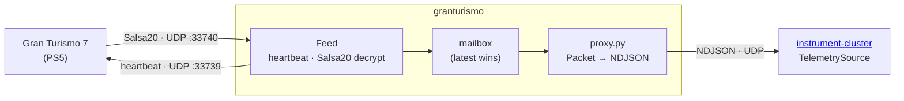

# granturismo

Pure-Python library for reading Gran Turismo 7's unofficial UDP telemetry stream.
Point it at your PlayStation's IP address and it hands you a stream of decoded
`Packet` objects.

## How it works

GT7 only transmits telemetry while the client sends periodic heartbeat datagrams.
`Feed` manages that for you: it opens a UDP socket, maintains the heartbeat in a
background thread, decrypts each incoming packet (Salsa20/20, keys are
community-derived), and publishes the result to a single-slot mailbox. Older
packets are discarded in favour of the latest one — you always read the latest
state, never a queue backlog.

Always close the feed when you're done (use it as a context manager, or call
`.close()` explicitly), otherwise the console keeps streaming indefinitely.



## Installation

```bash
uv add git+https://github.com/chrshdl/granturismo.git
```

Or build the self-contained tarball for deployment (see [Bundle](#bundle) below).

## Reading packets

```python
from granturismo import Feed
```

Open a feed with the PlayStation's IP address:

```python
with Feed("192.168.1.x") as feed:
    packet = feed.get()
```

Three access patterns are available:

| Method | Behaviour |
|---|---|
| `feed.get()` | Block until a new packet arrives, return it. |
| `feed.get_latest(timeout)` | Wait up to `timeout` seconds; return the packet or `None` on timeout. |
| `feed.get_nowait()` | Return the most recent packet immediately, or `None` if none has arrived yet. |

All three return `None` once the feed is closed.

## Examples

### Print a single packet

```bash
python3 examples/quickstart.py <PlayStation IP>
```

```python
from granturismo import Feed
import sys

if __name__ == '__main__':
    ip_address = sys.argv[1]

    with Feed(ip_address) as feed:
        # get() blocks until the first telemetry packet arrives
        print(feed.get())
```

### Live suspension heights in the terminal

Uses `curses` to update a fixed region of the terminal in place.

```bash
python3 examples/stream_suspension.py <PlayStation IP>
```

```python
from granturismo import Feed
from granturismo.model import Wheels
import datetime as dt
import time, sys
import curses

stdscr = curses.initscr()

def report_suspension(wheels: Wheels) -> None:
    curr_time = dt.datetime.fromtimestamp(time.time()).isoformat()
    stdscr.addstr(0, 0, f'[{curr_time}] Suspension Height')
    stdscr.addstr(1, 0, f'\t{wheels.front_left.suspension_height:.3f}    {wheels.front_right.suspension_height:.3f}')
    stdscr.addstr(2, 0, f'\t{wheels.rear_left.suspension_height:.3f}    {wheels.rear_right.suspension_height:.3f}')
    stdscr.refresh()

if __name__ == '__main__':
    ip_address = sys.argv[1]

    # Without `with`, start and close the feed manually.
    feed = Feed(ip_address)
    feed.start()

    try:
        while True:
            # Wait up to a second for a packet; skip if the game is paused or loading.
            packet = feed.get_latest(timeout=1.0)
            if packet is None:
                continue

            if not packet.flags.loading_or_processing and not packet.flags.paused:
                report_suspension(packet.wheels)
    finally:
        curses.echo()
        curses.nocbreak()
        curses.endwin()
        feed.close()
```

### Live position plot

Draws the car's path on a matplotlib figure as it drives. X and Z are the
horizontal plane; Z is negated so the orientation matches the in-game minimap.
Point colour encodes speed relative to the car's rated top speed.

```bash
python3 examples/stream_position.py <PlayStation IP>
```

```python
import sys
from granturismo import Feed
import matplotlib.pyplot as plt

if __name__ == '__main__':
    ip_address = sys.argv[1]

    plt.ion()
    fig, ax = plt.subplots(figsize=(8, 8))
    ax.axis('off')
    plt.xticks([])
    plt.yticks([])

    px, pz = None, None

    with Feed(ip_address) as feed:
        while True:
            packet = feed.get()

            x, z = packet.position.x, -packet.position.z
            if px is None:
                px, pz = x, z
                continue

            # Map speed fraction to a plasma colour; multiply by 3 to spread
            # the gradient across the lower end of the speed range.
            speed = min(1, packet.car_speed / packet.car_max_speed) * 3
            color = plt.cm.plasma(speed)

            plt.plot([px, x], [pz, z], color=color)
            plt.gca().set_aspect('equal', adjustable='box')
            plt.pause(0.00000000000000000001)

            px, pz = x, z
```

## Packet reference

See [PACKET.md](PACKET.md) for the full field listing — top-level fields, per-wheel fields, and the `Flags` bitfield.

## Bundle

`build_tarball.py` produces an architecture-independent tarball containing
`proxy-wrapper.py` and the `granturismo` package (including `proxy.py`, a
UDP→NDJSON forwarder). Because the library uses only the standard library, the
bundle vendors nothing and runs on a plain `python3`.

```bash
python scripts/build_tarball.py --lib-root . --output dist/granturismo-selfcontained.tar.gz
```

## Credits

The GT7 Simulator Interface was reverse-engineered by the community.
[Nenkai](https://github.com/Nenkai) identified the protocol, the Salsa20 key and
nonce derivation, and the meaning of most packet fields.
[tarnheld](https://www.gtplanet.net/forum/threads/gt7-is-compatible-with-motion-rig.410728/page-4)
contributed additional field identification.
